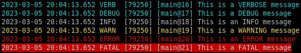
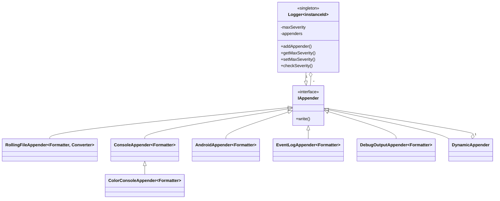
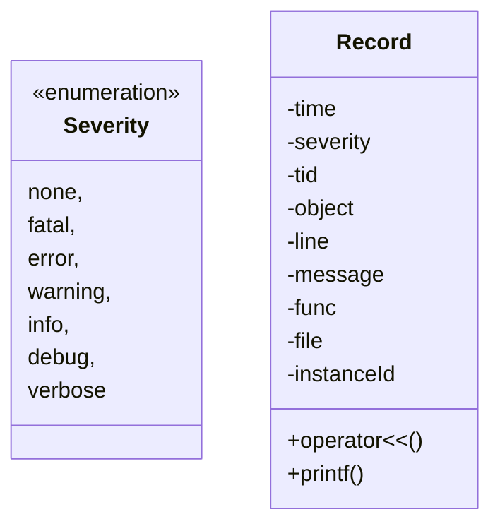
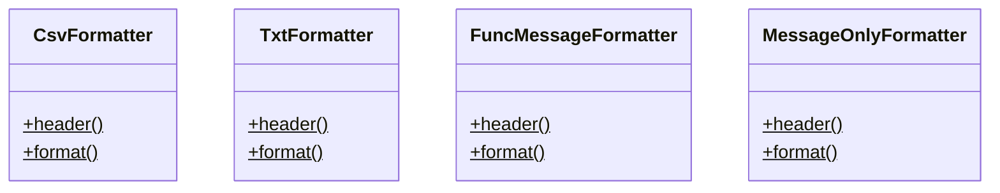
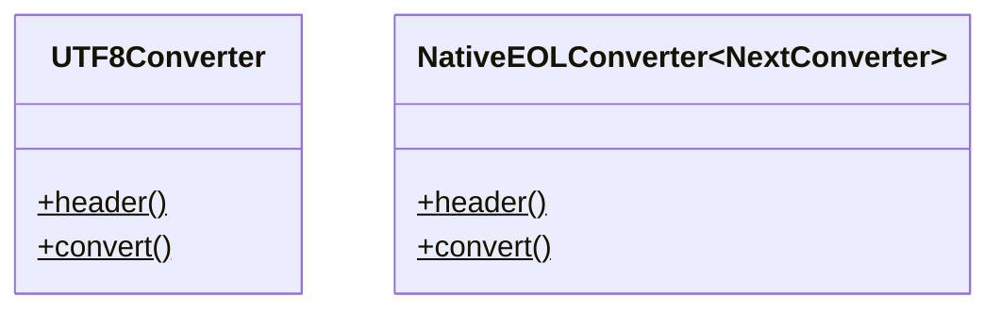
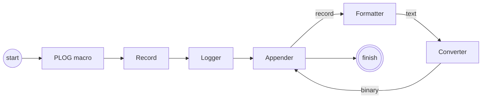

# Plog - portable, simple and extensible C++ logging library
Pretty powerful logging library in about 1000 lines of code [](https://github.com/SergiusTheBest/plog/actions/workflows/ci.yml) [](https://ci.appveyor.com/project/SergiusTheBest/plog/branch/master) [](https://circleci.com/gh/SergiusTheBest/plog) [](https://cirrus-ci.com/github/SergiusTheBest/plog)



- [Introduction](#introduction)
  - [Hello log!](#hello-log)
  - [Features](#features)
- [Usage](#usage)
  - [Step 1: Adding includes](#step-1-adding-includes)
  - [Step 2: Initialization](#step-2-initialization)
  - [Step 3: Logging](#step-3-logging)
    - [Basic logging macros](#basic-logging-macros)
    - [Conditional logging macros](#conditional-logging-macros)
    - [Logger severity checker](#logger-severity-checker)
- [Advanced usage](#advanced-usage)
  - [Changing severity at runtime](#changing-severity-at-runtime)
  - [Custom initialization](#custom-initialization)
  - [Multiple appenders](#multiple-appenders)
  - [Multiple loggers](#multiple-loggers)
  - [Share log instances across modules (exe, dll, so, dylib)](#share-log-instances-across-modules-exe-dll-so-dylib)
  - [Chained loggers](#chained-loggers)
- [Architecture](#architecture)
  - [Overview](#overview)
  - [Logger](#logger)
  - [Record](#record)
  - [Formatter](#formatter)
    - [TxtFormatter](#txtformatter)
    - [TxtFormatterUtcTime](#txtformatterutctime)
    - [CsvFormatter](#csvformatter)
    - [CsvFormatterUtcTime](#csvformatterutctime)
    - [FuncMessageFormatter](#funcmessageformatter)
    - [MessageOnlyFormatter](#messageonlyformatter)
  - [Converter](#converter)
    - [UTF8Converter](#utf8converter)
    - [NativeEOLConverter](#nativeeolconverter)
  - [Appender](#appender)
    - [RollingFileAppender](#rollingfileappender)
    - [ConsoleAppender](#consoleappender)
    - [ColorConsoleAppender](#colorconsoleappender)
    - [AndroidAppender](#androidappender)
    - [EventLogAppender](#eventlogappender)
    - [DebugOutputAppender](#debugoutputappender)
    - [DynamicAppender](#dynamicappender)
- [Miscellaneous notes](#miscellaneous-notes)
  - [Lazy stream evaluation](#lazy-stream-evaluation)
  - [Stream improvements over std::ostream](#stream-improvements-over-stdostream)
  - [Automatic 'this' pointer capture](#automatic-this-pointer-capture)
  - [Headers to include](#headers-to-include)
  - [Unicode](#unicode)
  - [Wide string support](#wide-string-support)
  - [Performance](#performance)
  - [Printf style formatting](#printf-style-formatting)
  - [LOG_XXX macro name clashes](#log_xxx-macro-name-clashes)
  - [Disable logging to reduce binary size](#disable-logging-to-reduce-binary-size)
- [Extending](#extending)
  - [Custom data type](#custom-data-type)
  - [Custom appender](#custom-appender)
  - [Custom formatter](#custom-formatter)
  - [Custom converter](#custom-converter)
- [Samples](#samples)
- [References](#references)
  - [Competing C++ log libraries](#competing-c-log-libraries)
  - [Tools and useful info](#tools-and-useful-info)
- [License](#license)
- [Version history](#version-history)

# Introduction

## Hello log!
Plog is a C++ logging library that is designed to be as simple, small and flexible as possible. It is created as an alternative to existing large libraries and provides some unique features as [CSV log format]((#csvformatter)) and [wide string support](#wide-string-support).

Here is a minimal hello log sample:

```cpp
#include <plog/Log.h> // Step1: include the headers
#include "plog/Initializers/RollingFileInitializer.h"

int main()
{
    plog::init(plog::debug, "Hello.txt"); // Step2: initialize the logger

    // Step3: write log messages using a special macro
    // There are several log macros, use the macro you liked the most

    PLOGD << "Hello log!"; // short macro
    PLOG_DEBUG << "Hello log!"; // long macro
    PLOG(plog::debug) << "Hello log!"; // function-style macro
    
    // Also you can use LOG_XXX macro but it may clash with other logging libraries
    LOGD << "Hello log!"; // short macro
    LOG_DEBUG << "Hello log!"; // long macro
    LOG(plog::debug) << "Hello log!"; // function-style macro

    return 0;
}
```

And its output:

```
2015-05-18 23:12:43.921 DEBUG [21428] [main@13] Hello log!
2015-05-18 23:12:43.968 DEBUG [21428] [main@14] Hello log!
2015-05-18 23:12:43.968 DEBUG [21428] [main@15] Hello log!
```

## Features
- Very small (slightly more than 1000 LOC)
- Easy to use
- Headers only
- No 3rd-party dependencies
- Cross-platform: Windows, Linux, FreeBSD, macOS, Android, RTEMS (gcc, clang, msvc, mingw, mingw-w64, icc, c++builder)
- Thread and type safe
- Formatters: [TXT](#txtformatter), [CSV](#csvformatter), [FuncMessage](#funcmessageformatter), [MessageOnly](#messageonlyformatter)
- Appenders: [RollingFile](#rollingfileappender), [Console](#consoleappender), [ColorConsole](#colorconsoleappender), [Android](#androidappender), [EventLog](#eventlogappender), [DebugOutput](#debugoutputappender), [DynamicAppender](#dynamicappender)
- [Automatic 'this' pointer capture](#automatic-this-pointer-capture) (supported only on msvc)
- [Lazy stream evaluation](#lazy-stream-evaluation)
- [Unicode aware](#unicode), files are stored in UTF-8, supports [Utf8Everywhere](http://utf8everywhere.org)
- Doesn't require C++11
- [Extendable](#extending)
- No `windows.h` dependency
- Can use UTC or local time
- Can print buffers in HEX or ASCII
- Can print `std` containers
- Uses modern CMake

# Usage
To start using plog you need to make 3 simple steps.

## Step 1: Adding includes
At first your project needs to know about plog. For that you have to:

1. Add `plog/include` to the project include paths
2. Add `#include <plog/Log.h>` into your cpp/h files (if you have precompiled headers it is a good place to add this include there)

## Step 2: Initialization
The next step is to initialize the [Logger](#logger). This is done by the following `plog::init` function:

```cpp
Logger& init(Severity maxSeverity, const char/wchar_t* fileName, size_t maxFileSize = 0, int maxFiles = 0);
```

`maxSeverity` is the logger severity upper limit. All log messages have its own severity and if it is higher than the limit those messages are dropped. Plog defines the following severity levels:

```cpp
enum Severity
{
    none = 0,
    fatal = 1,
    error = 2,
    warning = 3,
    info = 4,
    debug = 5,
    verbose = 6
};
```

> **Note** Messages with severity level `none` will always be printed.

The log format is determined automatically by `fileName` file extension:

- .csv => [CSV format](#csvformatter)
- anything else => [TXT format](#txtformatter)

The rolling behavior is controlled by `maxFileSize` and `maxFiles` parameters:

- `maxFileSize` - the maximum log file size in bytes
- `maxFiles` - a number of log files to keep

If one of them is zero then log rolling is disabled.

Sample:

```cpp
plog::init(plog::warning, "c:\\logs\\log.csv", 1000000, 5);
```

Here the logger is initialized to write all messages with up to warning severity to a file in csv format. Maximum log file size is set to 1'000'000 bytes and 5 log files are kept.

> **Note** See [Custom initialization](#custom-initialization) for advanced usage.

## Step 3: Logging
Logging is performed with the help of special macros. A log message is constructed using stream output operators `<<`. Thus it is type-safe and extendable in contrast to a format string output.

### Basic logging macros
This is the most used type of logging macros. They do unconditional logging.

#### Long macros:

```cpp
PLOG_VERBOSE << "verbose";
PLOG_DEBUG << "debug";
PLOG_INFO << "info";
PLOG_WARNING << "warning";
PLOG_ERROR << "error";
PLOG_FATAL << "fatal";
PLOG_NONE << "none";
```

#### Short macros:

```cpp
PLOGV << "verbose";
PLOGD << "debug";
PLOGI << "info";
PLOGW << "warning";
PLOGE << "error";
PLOGF << "fatal";
PLOGN << "none";
```

#### Function-style macros:

```cpp
PLOG(severity) << "msg";
```

### Conditional logging macros
These macros are used to do conditional logging. They accept a condition as a parameter and perform logging if the condition is true.

#### Long macros:

```cpp
PLOG_VERBOSE_IF(cond) << "verbose";
PLOG_DEBUG_IF(cond) << "debug";
PLOG_INFO_IF(cond) << "info";
PLOG_WARNING_IF(cond) << "warning";
PLOG_ERROR_IF(cond) << "error";
PLOG_FATAL_IF(cond) << "fatal";
PLOG_NONE_IF(cond) << "none";
```

#### Short macros:

```cpp
PLOGV_IF(cond) << "verbose";
PLOGD_IF(cond) << "debug";
PLOGI_IF(cond) << "info";
PLOGW_IF(cond) << "warning";
PLOGE_IF(cond) << "error";
PLOGF_IF(cond) << "fatal";
PLOGN_IF(cond) << "none";
```

#### Function-style macros:

```cpp
PLOG_IF(severity, cond) << "msg";
```

### Logger severity checker
In some cases there is a need to perform a group of actions depending on the current logger severity level. There is a special macro for that. It helps to minimize performance penalty when the logger is inactive.

```cpp
IF_PLOG(severity)
```

Sample:

```cpp
IF_PLOG(plog::debug) // we want to execute the following statements only at debug severity (and higher)
{
    for (int i = 0; i < vec.size(); ++i)
    {
        PLOGD << "vec[" << i << "]: " << vec[i];
    }
}
```

# Advanced usage

## Changing severity at runtime
It is possible to set the maximum severity not only at the logger initialization time but at any time later. There are special accessor methods:

```cpp
Severity Logger::getMaxSeverity() const;
Logger::setMaxSeverity(Severity severity);
```

To get the logger use `plog::get` function:

```cpp
Logger* get();
```

Sample:

```cpp
plog::get()->setMaxSeverity(plog::debug);
```

## Custom initialization
Non-typical log cases require the use of custom initialization. It is done by the following `plog::init` function:

```cpp
Logger& init(Severity maxSeverity = none, IAppender* appender = NULL);
```

You have to construct an [Appender](#appender) parameterized with a [Formatter](#formatter) and pass it to the `plog::init` function.

> **Note** The appender lifetime should be static!

Sample:

```cpp
static plog::ConsoleAppender<plog::TxtFormatter> consoleAppender;
plog::init(plog::debug, &consoleAppender);
```

## Multiple appenders
It is possible to have multiple [Appenders](#appender) within a single [Logger](#logger). In such case log message will be written to all of them. Use the following method to accomplish that:

```cpp
Logger& Logger::addAppender(IAppender* appender);
```

Sample:

```cpp
static plog::RollingFileAppender<plog::CsvFormatter> fileAppender("MultiAppender.csv", 8000, 3); // Create the 1st appender.
static plog::ConsoleAppender<plog::TxtFormatter> consoleAppender; // Create the 2nd appender.
plog::init(plog::debug, &fileAppender).addAppender(&consoleAppender); // Initialize the logger with the both appenders.
```

Here the logger is initialized in the way when log messages are written to both a file and a console.

*Refer to [MultiAppender](samples/MultiAppender) for a complete sample.*

## Multiple loggers
Multiple [Loggers](#logger) can be used simultaneously each with their own separate configuration. The [Loggers](#logger) differ by their instanceId (that is implemented as a template parameter). The default instanceId is zero. Initialization is done by the appropriate template `plog::init` functions:

```cpp
Logger<instanceId>& init<instanceId>(...);
```

To get a logger use `plog::get` function (returns `NULL` if the logger is not initialized):

```cpp
Logger<instanceId>* get<instanceId>();
```

All logging macros have their special versions that accept an instanceId parameter. These kind of macros have an underscore at the end:

```cpp
PLOGD_(instanceId) << "debug";
PLOGD_IF_(instanceId, condition) << "conditional debug";
IF_PLOG_(instanceId, severity)
```

Sample:

```cpp
enum // Define log instanceIds. Default is 0 and is omitted from this enum.
{
    SecondLog = 1
};

int main()
{
    plog::init(plog::debug, "MultiInstance-default.txt"); // Initialize the default logger instance.
    plog::init<SecondLog>(plog::debug, "MultiInstance-second.txt"); // Initialize the 2nd logger instance.

    // Write some messages to the default log.
    PLOGD << "Hello default log!";

    // Write some messages to the 2nd log.
    PLOGD_(SecondLog) << "Hello second log!";

    return 0;
}
```

*Refer to [MultiInstance](samples/MultiInstance) for a complete sample.*

## Share log instances across modules (exe, dll, so, dylib)
For applications that consist of several binary modules, plog instances can be local (each module has its own instance) or shared (all modules use the same instance). In case of shared you have to initialize plog only in one module, other modules will reuse that instance.

Sharing behavior is controlled by the following macros and is OS-dependent:

|Macro|OS|Behavior|
|--|--|--|
|PLOG_GLOBAL|Linux/Unix|Shared|
|PLOG_LOCAL|Linux/Unix|Local|
|PLOG_EXPORT|Linux/Unix|n/a|
|PLOG_IMPORT|Linux/Unix|n/a|
|<default>|Linux/Unix|According to compiler settings|
|PLOG_GLOBAL|Windows|n/a|
|PLOG_LOCAL|Windows|Local|
|PLOG_EXPORT|Windows|Shared (exports)|
|PLOG_IMPORT|Windows|Shared (imports)|
|<default>|Windows|Local|

For sharing on Windows one module should use `PLOG_EXPORT` and others should use `PLOG_IMPORT`. Also be careful on Linux/Unix: if you don't specify sharing behavior it will be determined by compiler settings (`-fvisibility`).

*Refer to [Shared](samples/Shared) for a complete sample.*

## Chained loggers
A [Logger](#logger) can work as an [Appender](#appender) for another [Logger](#logger). So you can chain several loggers together. This is useful for streaming log messages from a shared library to the main application binary.

*Important: don't forget to specify `PLOG_LOCAL` sharing mode on Linux/Unix systems for this sample.*

Sample:

```cpp
// shared library

// Function that initializes the logger in the shared library.
extern "C" void EXPORT initialize(plog::Severity severity, plog::IAppender* appender)
{
    plog::init(severity, appender); // Initialize the shared library logger.
}

// Function that produces a log message.
extern "C" void EXPORT foo()
{
    PLOGI << "Hello from shared lib!";
}
```

```cpp
// main app

// Functions imported from the shared library.
extern "C" void initialize(plog::Severity severity, plog::IAppender* appender);
extern "C" void foo();

int main()
{
    plog::init(plog::debug, "ChainedApp.txt"); // Initialize the main logger.

    PLOGD << "Hello from app!"; // Write a log message.

    initialize(plog::debug, plog::get()); // Initialize the logger in the shared library. Note that it has its own severity.
    foo(); // Call a function from the shared library that produces a log message.

    return 0;
}
```

*Refer to [Chained](samples/Chained) for a complete sample.*

# Architecture

## Overview
Plog is designed to be small but flexible, so it prefers templates to interface inheritance. All main entities are shown on the following UML diagram:


    






There are 5 functional parts:

- [Logger](#logger) - the main object, implemented as singleton
- [Record](#record) - keeps log data: time, message, etc
- [Appender](#appender) - represents a log data destination: file, console, etc
- [Formatter](#formatter) - formats log data into a string
- [Converter](#converter) - converts formatter output into a raw buffer

The log data flow is shown below:



## Logger
[Logger](#logger) is a center object of the whole logging system. It is a singleton and thus it forms a known single entry point for configuration and processing log data. [Logger](#logger) can act as [Appender](#appender) for another [Logger](#logger) because it implements `IAppender` interface. Also there can be several independent loggers that are parameterized by an integer instanceId number. The default instanceId is 0.

```cpp
template<int instanceId>
class Logger : public util::Singleton<Logger<instanceId> >, public IAppender
{
public:
    Logger(Severity maxSeverity = none);

    Logger& addAppender(IAppender* appender);

    Severity getMaxSeverity() const;
    void setMaxSeverity(Severity severity);
    bool checkSeverity(Severity severity) const;

    virtual void write(const Record& record);
    void operator+=(const Record& record);
};
```

## Record
[Record](#record) stores all log data. It includes:

- time
- severity
- thread id
- 'this' pointer (if a log message is written from within an object)
- source line
- source file name
- function name
- message
- instance id

> **Note** Source file name isn't captured by default. To enable it define PLOG_CAPTURE_FILE.

Also [Record](#record) has a number of overloaded stream output operators to construct a message.

```cpp
class Record
{
public:
    Record(Severity severity, const char* func, size_t line, const char* file, const void* object, int instanceId);

    //////////////////////////////////////////////////////////////////////////
    // Stream output operators

    Record& operator<<(char data);
    Record& operator<<(wchar_t data);

    template<typename T>
    Record& operator<<(const T& data);

    //////////////////////////////////////////////////////////////////////////
    // Getters

    virtual const util::Time& getTime() const;
    virtual Severity getSeverity() const;
    virtual unsigned int getTid() const;
    virtual const void* getObject() const;
    virtual size_t getLine() const;
    virtual const util::nchar* getMessage() const;
    virtual const char* getFunc() const;
    virtual const char* getFile() const;
    virtual int getInstanceId() const;
};
```

*See [Stream improvements over std::ostream](#stream-improvements-over-stdostream).*

*Refer to [Demo](samples/Demo) sample to see what can be written to the log stream.*

## Formatter
[Formatter](#formatter) is responsible for formatting log data from [Record](#record) into various string representations (binary forms can be used too). There is no base class for formatters, they are implemented as classes with static functions `format` and `header`:

```cpp
class Formatter
{
public:
    static util::nstring header();
    static util::nstring format(const Record& record);
};
```

*See [How to implement a custom formatter](#custom-formatter).*

### TxtFormatter
This is a classic log format available in almost any log library. It is good for console output and it is easy to read without any tools.

```
2014-11-11 00:29:06.245 FATAL [4460] [main@22] fatal
2014-11-11 00:29:06.261 ERROR [4460] [main@23] error
2014-11-11 00:29:06.261 INFO  [4460] [main@24] info
2014-11-11 00:29:06.261 WARN  [4460] [main@25] warning
2014-11-11 00:29:06.261 DEBUG [4460] [main@26] debug
2014-11-11 00:29:06.261 INFO  [4460] [main@32] This is a message with "quotes"!
2014-11-11 00:29:06.261 DEBUG [4460] [Object::Object@8]
2014-11-11 00:29:06.261 DEBUG [4460] [Object::~Object@13]
```

### TxtFormatterUtcTime
This is a variant of [TxtFormatter](#txtformatter) that uses UTC time instead of local time.

### CsvFormatter
This is the most powerful log format. It can be easily read without any tools (but slighlty harder than [TXT format](#txtformatter)) and can be heavily analyzed if it is opened with a CSV-aware tool (like Excel). One rows can be highlighted according to their cell values, another rows can be hidden, columns can be manipulated and you can even run SQL queries on log data! This is a recommended format if logs are big and require heavy analysis. Also 'this' pointer is shown so object instances can be told apart.

```
Date;Time;Severity;TID;This;Function;Message
2014/11/14;15:22:25.033;FATAL;4188;00000000;main@22;"fatal"
2014/11/14;15:22:25.033;ERROR;4188;00000000;main@23;"error"
2014/11/14;15:22:25.033;INFO;4188;00000000;main@24;"info"
2014/11/14;15:22:25.033;WARN;4188;00000000;main@25;"warning"
2014/11/14;15:22:25.048;DEBUG;4188;00000000;main@26;"debug"
2014/11/14;15:22:25.048;INFO;4188;00000000;main@32;"This is a message with ""quotes""!"
2014/11/14;15:22:25.048;DEBUG;4188;002EF4E3;Object::Object@8;
2014/11/14;15:22:25.048;DEBUG;4188;002EF4E3;Object::~Object@13;
```

> **Note** Message size is limited to 32000 chars.

### CsvFormatterUtcTime
This is a variant of [CsvFormatter](#csvformatter) that uses UTC time instead of local time.

### FuncMessageFormatter
This format is designed to be used with appenders that provide their own timestamps (like [AndroidAppender](#androidappender) or linux syslog facility).

```
main@22: fatal
main@23: error
main@24: info
main@25: warning
main@26: debug
main@32: This is a message with "quotes"!
Object::Object@8:
Object::~Object@13:
```

### MessageOnlyFormatter
Use this formatter when you're interested only in a log message.

```
fatal
error
info
warning
debug
This is a message with "quotes"!
```

## Converter
[Converter](#converter) is responsible for conversion of [Formatter](#formatter) output data to a raw buffer (represented as `std::string`). It is used by [RollingFileAppender](#rollingfileappender) to perform a conversion before writing to a file. There is no base class for converters, they are implemented as classes with static functions `convert` and `header`:

```cpp
class Converter
{
public:
    static std::string header(const util::nstring& str);
    static std::string convert(const util::nstring& str);
};
```

*See [How to implement a custom converter](#custom-converter).*

### UTF8Converter
[UTF8Converter](#utf8converter) is a default converter in plog. It converts string data to UTF-8 with BOM.

### NativeEOLConverter
This converter converts `<LF>` line endings to `<CRLF>` on Windows and does nothing on everything else. As a template parameter it accepts another converter that is called next (by default [UTF8Converter](#utf8converter)).

Sample:

```cpp
plog::RollingFileAppender<plog::TxtFormatter, plog::NativeEOLConverter<> > fileAppender("NativeEOL.log");
```

*Refer to [NativeEOL](samples/NativeEOL) for a complete sample.*

## Appender
[Appender](#appender) uses [Formatter](#formatter) and [Converter](#converter) to get a desired representation of log data and outputs (appends) it to a file/console/etc. All appenders must implement `IAppender` interface (the only interface in plog):

```cpp
class IAppender
{
public:
    virtual ~IAppender();
    virtual void write(const Record& record) = 0;
};
```

*See [How to implement a custom appender](#custom-appender).*

### RollingFileAppender
This appender outputs log data to a file with rolling behavior. As template parameters it accepts both [Formatter](#formatter) and [Converter](#converter).

```cpp
RollingFileAppender<Formatter, Converter>::RollingFileAppender(const util::nchar* fileName, size_t maxFileSize = 0, int maxFiles = 0);
```

- `fileName` - a log file name
- `maxFileSize` - the maximum log file size in bytes
- `maxFiles` - a number of log files to keep

If `maxFileSize` or `maxFiles` is 0 then rolling behavior is turned off.

The sample file names produced by this appender:

- mylog.log <== current log file (size < maxFileSize)
- mylog.1.log <== previous log file (size >= maxFileSize)
- mylog.2.log <== previous log file (size >= maxFileSize)

A file name can be changed at an arbitrary moment by calling `setFileName` as well as `maxFiles` and `maxFileSize` can be changed by calling `setMaxFiles` and `setMaxFileSize`.

> **Note** The lowest `maxFileSize` is 1000 bytes.

> **Note** A log file is created on the first log message.

### ConsoleAppender
This appender outputs log data to `stdout` or `stderr`.  As a template parameter it accepts [Formatter](#formatter).

```cpp
ConsoleAppender<Formatter>::ConsoleAppender(OutputStream outStream = streamStdOut);
```

### ColorConsoleAppender
This appender outputs log data to `stdout` or `stderr` using colors that depend on a log message severity level.  As a template parameter it accepts [Formatter](#formatter).

```cpp
ColorConsoleAppender<Formatter>::ColorConsoleAppender(OutputStream outStream = streamStdOut);
```

### AndroidAppender
[AndroidAppender](#androidappender) uses Android logging system to output log data. It can be viewed with [logcat](http://developer.android.com/tools/help/logcat.html) or in a log window of Android IDEs. As a template parameter this appender accepts [Formatter](#formatter) (usually [FuncMessageFormatter](#funcmessageformatter)).

```cpp
AndroidAppender<Formatter>::AndroidAppender(const char* tag);
```
### EventLogAppender
This appender outputs log data to the windows event log. It can be viewed with the windows event log viewer.  As a template parameter it accepts [Formatter](#formatter).
The constructor parameter is the event source name - typically it is the name of the application or a subcomponent of the application. It must be unique for the whole system.

```cpp
EventLogAppender<Formatter>::EventLogAppender(const wchar_t* sourceName);
```

[EventLogAppender](#eventlogappender) must be registered in the windows registry before use (before calling the constructor). There is a helper class for that:

```cpp
bool EventLogAppenderRegistry::add(const wchar_t* sourceName, const wchar_t* logName = L"Application");
bool EventLogAppenderRegistry::exists(const wchar_t* sourceName, const wchar_t* logName = L"Application");
void EventLogAppenderRegistry::remove(const wchar_t* sourceName, const wchar_t* logName = L"Application");
```

Registry operations are system-wide and require administrator rights. Also they are persistent so can be performed only once (when the application is installed/uninstalled).

### DebugOutputAppender
[DebugOutputAppender](#debugoutputappender) sends log data to the debugger (works only on Windows). As a template parameter this appender accepts [Formatter](#formatter).

```cpp
DebugOutputAppender<Formatter>::DebugOutputAppender();
```

### DynamicAppender
[DynamicAppender](#dynamicappender) is a wrapper that can add/remove appenders dynamically (at any point of time) in a thread-safe manner.

```cpp
DynamicAppender& DynamicAppender::addAppender(IAppender* appender);
DynamicAppender& DynamicAppender::removeAppender(IAppender* appender);
```

*Refer to [DynamicAppender sample](samples/DynamicAppender) for a complete sample.*

# Miscellaneous notes

## Lazy stream evaluation
Log messages are constructed using lazy stream evaluation. It means that if a log message will be dropped (because of its severity) then stream output operators are not executed. Thus performance penalty of unprinted log messages is negligible.

```cpp
PLOGD << /* the following statements will be executed only when the logger severity is debug or higher */ ...
```

## Stream improvements over std::ostream
Stream output in plog has several improvements over the standard `std::ostream`:

- handles wide chars/strings: `wchar_t`, `wchar_t*`, `std::wstring`
- handles `NULL` values for C-strings: `char*` and `wchar_t*`
- implicitly casts objects to: `std::string` and `std::wstring` (if they have an appropriate cast operator)
- supports `QString` and `QStringRef` (you need to include Qt headers before plog)
- supports `std::filesystem::path`
- supports managed C++ `System::String^`

## Automatic 'this' pointer capture
'This' pointer is captured automatically to log data and can be printed by [CsvFormatter](#csvformatter). Unfortunately this feature is supported only on msvc 2010 and higher. It's disabled by default (due to some compatibility issues with `__if_exists` C++ extension), to enable it define `PLOG_ENABLE_GET_THIS`.

## Headers to include
The core plog functionality is provided by inclusion of `plog/Log.h` file. Extra components require inclusion of corresponding extra headers after `plog/Log.h`.

Core components are:
- [TxtFormatter](#txtformatter)/[TxtFormatterUtcTime](#txtformatterutctime)
- [CsvFormatter](#csvformatter)/[CsvFormatterUtcTime](#csvformatterutctime)
- [UTF8Converter](#utf8converter)
- [NativeEOLConverter](#nativeeolconverter)
- [RollingFileAppender](#rollingfileappender)

## Unicode
Plog is unicode aware and wide string friendly. All messages are converted to a system native char type:

- Windows
  - `wchar_t` - by default 
  - `char` - if compiling with `/utf-8` switch or set `PLOG_CHAR_IS_UTF8` to 1
- all other systems
  - `char`

Also `char` is treated as:

- Windows
  - active code page - be default
  - UTF-8 - if compiling with `/utf-8` switch or set `PLOG_CHAR_IS_UTF8` to 1
- all other systems  
  - UTF-8

Internally plog uses `nstring`, `nstringstream` and `nchar` ('n' for native) that are defined as:

```cpp
#if PLOG_CHAR_IS_UTF8
    typedef std::string nstring;
    typedef std::ostringstream nostringstream;
    typedef std::istringstream nistringstream;
    typedef std::ostream nostream;
    typedef char nchar;
#else
    typedef std::wstring nstring;
    typedef std::wostringstream nostringstream;
    typedef std::wistringstream nistringstream;
    typedef std::wostream nostream;
    typedef wchar_t nchar;
#endif
```

By default all log files are stored in UTF-8 with BOM thanks to [UTF8Converter](#utf8converter).

## Wide string support

Whether `wchar_t`, `wchar_t*`, `std::wstring` can be streamed to log messages or not is controlled by the `PLOG_ENABLE_WCHAR_INPUT` macro. Set it to a non-zero value to enable wide string support. By default wide string support is enabled for Windows and disabled for all non-Windows systems.

> **Note** Wide string support requires linking to `iconv` on macOS.

## Performance
Plog is not using any asynchronous techniques so it may slow down your application on large volumes of log messages.

Producing a single log message takes the following amount of time:

|CPU|OS|Time per a log call, microsec|
|----|----|:----:|
|AMD Phenom II 1055T @3.5GHz|Windows 2008 R2|12|
|AMD Phenom II 1055T @3.5GHz|Linux Mint 17.1|8|
|Intel Core i3-3120M @2.5GHz|Windows 2012 R2|25|
|Intel Core i5-2500K @4.2GHz|Windows 2008 R2|8|
|Intel Atom N270 @1.6GHz|Windows 2003|68|

Assume 20 microsec per a log call then 500 log calls per a second will slow down an application by 1%. It is acceptable for most use cases.

*Refer to [Performance](samples/Performance) for a complete sample.*

## Printf style formatting
Plog supports printf style formatting:

```cpp
PLOGI.printf("%d %s", 42, "test");
PLOGI.printf(L"%d %S", 42, "test"); // wchar_t version
```

## LOG_XXX macro name clashes
`LOG_XXX` macro names may be in conflict with other libraries (for example [syslog](https://linux.die.net/man/3/syslog)). In such cases you can disable the `LOG_XXX` macro by defining `PLOG_OMIT_LOG_DEFINES` and use `PLOG_XXX`.

*Define `PLOG_OMIT_LOG_DEFINES` before `#include <plog/Log.h>` or in the project settings!*

## Disable logging to reduce binary size
Logging code makes binary files larger. If you use it for debugging you can remove all logging code from release builds by defining the macro `PLOG_DISABLE_LOGGING`.

# Extending
Plog can be easily extended to support new:

- [custom data type](#custom-data-type)
- [custom appender](#custom-appender)
- [custom formatter](#custom-formatter)
- [custom converter](#custom-converter)

## Custom data type
To output a custom data type to a log message implement the following function:

```cpp
namespace plog
{
    Record& operator<<(Record& record, const MyType& t);
}
```

*Refer to [CustomType](samples/CustomType) for a complete sample.*

## Custom appender
A custom appender must implement the `IAppender` interface. Also it may accept [Formatter](#formatter) and [Converter](#converter) as template parameters however this is optional.

```cpp
namespace plog
{
    template<class Formatter>
    class MyAppender : public IAppender
    {
    public:
        virtual void write(const Record& record);
    };
}
```

*Refer to [CustomAppender](samples/CustomAppender) for a complete sample.*

## Custom formatter
A formatter that is compatible with existing appenders must be a class with 2 static methods:

- `header` - returns a header for a new log
- `format` - formats [Record](#record) to a string

```cpp
namespace plog
{
    class MyFormatter
    {
    public:
        static util::nstring header();
        static util::nstring format(const Record& record);
    };
}
```

*Refer to [CustomFormatter](samples/CustomFormatter) for a complete sample.*

## Custom converter
A converter must be a class with 2 static methods:

- `header` - converts a header for a new log
- `convert` - converts log messages

```cpp
namespace plog
{
    class MyConverter
    {
    public:
        static std::string header(const util::nstring& str);
        static std::string convert(const util::nstring& str);
    };
}
```

*Refer to [CustomConverter](samples/CustomConverter) for a complete sample.*

# Samples
There are a number of samples that demonstrate various aspects of using plog. They can be found in the [samples](samples) folder:

|Sample|Description|
|------|-----------|
|[Android](samples/Android)|Shows how to use [AndroidAppender](#androidappender).|
|[Arduino](samples/Arduino)|Arduino sample - not finished yet!|
|[AscDump](samples/AscDump)|Shows how to use `plog::ascdump` to dump binary buffers into ASCII.|
|[Chained](samples/Chained)|Shows how to chain a logger in a shared library with the main logger (route messages).|
|[ColorConsole](samples/ColorConsole)|Shows how to use [ColorConsoleAppender](#colorconsoleappender).|
|[CustomAppender](samples/CustomAppender)|Shows how to implement a custom appender that stores log messages in memory.|
|[CustomConverter](samples/CustomConverter)|Shows how to implement a custom converter that encrypts log messages.|
|[CustomFormatter](samples/CustomFormatter)|Shows how to implement a custom formatter.|
|[CustomType](samples/CustomType)|Shows how to print a custom type to the log stream.|
|[CXX11](samples/CXX11)|Demonstrates log stream abilities for C++11 features.|
|[CXX17](samples/CXX17)|Demonstrates log stream abilities for C++17 features.|
|[DebugOutput](samples/DebugOutput)|Shows how to use [DebugOutputAppender](#debugoutputappender) to write to the windows debug output.|
|[Demo](samples/Demo)|Demonstrates log stream abilities, prints various types of messages.|
|[DisableLogging](samples/DisableLogging)|Shows how to disable logging (so it will be stripped from the binary).|
|[DynamicAppender](samples/DynamicAppender)|Shows how to add/remove appenders dynamically).|
|[EventLog](samples/EventLog)|Shows how to use [EventLogAppender](#eventlogappender) to write to the windows event log.|
|[Facilities](samples/Facilities)|Shows how to use logging per facilities via multiple logger instances (useful for big projects).|
|[Hello](samples/Hello)|A minimal introduction sample, shows the basic 3 steps to start using plog.|
|[HexDump](samples/HexDump)|Shows how to use `plog::hexdump` to dump binary buffers into hex.|
|[Library](samples/Library)|Shows plog usage in static libraries.|
|[MultiAppender](samples/MultiAppender)|Shows how to use multiple appenders with the same logger.|
|[MultiInstance](samples/MultiInstance)|Shows how to use multiple logger instances, each instance has its own independent configuration.|
|[NotShared](samples/NotShared)|Shows how to make logger instances local across binary modules (this is the default behavior on Windows but not on other platforms, so be careful).|
|[ObjectiveC](samples/ObjectiveC)|Shows that plog can be used in ObjectiveC++.|
|[Path](samples/Path)|A test sample to check that `std::filesystem::path` can be logged.|
|[Performance](samples/Performance)|Measures time per a log call.|
|[PrintVar](samples/PrintVar)|Shows how to use `PLOG_PRINT_VAR` to print variables.|
|[SetFileName](samples/SetFileName)|Shows how to change a log file name at arbitrary moment.|
|[Shared](samples/Shared)|Shows how to share logger instances across binary modules (this is the default behavior on everything except Windows, so be careful)|
|[SkipNativeEOL](samples/SkipNativeEOL)|Shows how to skip [NativeEOLConverter](#nativeeolconverter).|
|[UtcTime](samples/UtcTime)|Shows how to use UTC time instead of local time.|
|[Utf8Everywhere](samples/Utf8Everywhere)|Demonstrates how to use http://utf8everywhere.org on Windows.|

# References

## Competing C++ log libraries

- [Boost::Log](http://www.boost.org/doc/libs/release/libs/log/)
- [EasyLogging++](https://github.com/easylogging/easyloggingpp)
- [g2log](http://www.codeproject.com/Articles/288827/g-log-An-efficient-asynchronous-logger-using-Cplus)
- [g3log](https://github.com/KjellKod/g3log)
- [glog](https://code.google.com/p/google-glog/)
- [Log4cplus](http://sourceforge.net/projects/log4cplus/)
- [Log4cpp](http://log4cpp.sourceforge.net/)
- [Log4cxx](http://logging.apache.org/log4cxx/)
- [Pantheios](http://pantheios.sourceforge.net/)
- [spdlog](https://github.com/gabime/spdlog/)
- [reckless](https://github.com/mattiasflodin/reckless)
- [loguru](https://github.com/emilk/loguru)
- [blackhole](https://github.com/3Hren/blackhole)

## Tools and useful info

- [__if_exists Statement](https://msdn.microsoft.com/en-us/library/x7wy9xh3.aspx)
- [Controlling Symbol Visibility](https://developer.apple.com/library/mac/documentation/DeveloperTools/Conceptual/CppRuntimeEnv/Articles/SymbolVisibility.html)
- [Mermaid](https://mermaid-js.github.io/mermaid/)
- [DocToc](https://github.com/thlorenz/doctoc)
- [CMake](http://www.cmake.org)
- [Compiler support for C++11](https://en.cppreference.com/w/cpp/compiler_support/11)
- [Guide to predefined macros in C++ compilers (gcc, clang, msvc etc.)](https://blog.kowalczyk.info/article/j/guide-to-predefined-macros-in-c-compilers-gcc-clang-msvc-etc..html)

# License
This version of plog is licensed under the [MIT license](https://choosealicense.com/licenses/mit). You can freely use it in your commercial or opensource software.

# Version history

## Version 1.1.10 (20 Aug 2023)
- New: Add support for UTF-8 char encoding on Windows (#76, #69, #238, #239)\
 *This allows to use [Utf8Everywhere](http://utf8everywhere.org) approach*
- New: Add ArduinoAppender
- New: Publish on [PlatformIO Registry](https://registry.platformio.org) for embedded development (#244)
- New: Add support for `char8_t` strings
- New: Add tests
- Enh: Add rudimentary support of VS2005 (#232)
- Enh: Implementation of `vasprintf` emulation (#243)
- Fix: Parsing of templated classes (#251)
- Fix: Compiling with MSVC using C++20 (#236)
- Fix: No newline error with '-Wnewline-eof' build flag (#263)

## Version 1.1.9 (16 Dec 2022)
- New: Add ability to truncate log file using `>` in shell (#155)
- New: Add override specifier (to be able to build with `-Wsuggest-override`) (#231)
- New: Add nuget specs (#86)
- New: Add ability to add/remove appenders (#226)
- Fix: Printing `boost::filesystem::path` (#227)
- Fix: Building on C++ Builder 10.4 (#225)
- Fix: `PLOG_LOCAL` mode if symbol visibility set to default (#219)

## Version 1.1.8 (10 Jun 2022)
- Fix: 'operator <<' is ambiguous for string_view on Windows (#217)
- Fix: CMake + vcpkg: find_package (#211)
    
## Version 1.1.7 (09 Jun 2022)
- New: Add hex dumper (#111)
- New: Add ASCII dumper (#213)
- New: Add support for printing std containers (#207)
- New: Add console initializer
- New: Add PrintVar helper
- New: Add CMake find_package support (#171)
- Enh: Change license to MIT (#212)
- Fix: Specify calling convention for std stream manipulators (#210)
- Fix: Compilation on VS2010 (#207)
- Fix: Use add_custom_target for pseudo-project with headers (#216)

## Version 1.1.6 (06 Feb 2022)
- New: Ability to disable logging to reduce binary size (#130)
- New: Ability to change `maxFiles`/`maxFileSize` after initialization
- New: Logging `std::filesystem::path` without explicit conversion to `std::string` (#168, #185, #183)
- New: Allow to choose `stdout`/`stderr` for console appender (#162, #117)
- New: Ability to change log file name at runtime (#62)
- New: Ability to control sharing across modules (#96, #152, #20)
- New: Building on platforms without thread support (#161, #113)
- Enh: Change color functions from private to protected (#163)
- Enh: Do not include `plog/Init.h` in `plog/Log.h` (#127, #89)
- Fix: WideCharToMultiByte bug (#202)
- Fix: Building with Qt6 (#190)
- Fix: Compiling on GCC 4.4-4.7 (#176)
- Fix: Suppress UBSan false positive (#90)
- Fix: Don't share handle/fd to child process (#170)
- Fix: MSVC analyzer warnings (#148)
- Fix: File size truncation > 2GB on Windows (#160)
- Fix: [RTEMS](https://www.rtems.org) build on newer toolchain (#158, #159)

## Version 1.1.5 (21 Oct 2019)
- New: Use `NativeEOLConverter` by default (#145)
- New: Add logger `instanceId` into `Record` (#141)
- New: Add support for the printf style formatting (#139)
- New: Make `severityFromString` case-insensitive
- New: Define macro names with "PLOG" instead of "LOG" in order to avoid conflicts with "LOG" names defined in other packages or in system headers (#25, #129)
- New: Add option for building samples (ON per default) (#125, #126)
- New: Add CMake installer (#121, #122)
- New: Add support for `QStringRef`
- New: Modernize CMake (#106)
- New: Allow rollLogFiles to be called manually (#100, #103)
- New: Add ability to use UTC time (#101)
- Fix: Disable `PLOG_GET_THIS()` by default (#120, #132)
- Fix: Change `RegSetValueExW` prototype to match windows native declaration (void* -> BYTE*)
- Fix: Move `System::String^` handler to a free function (#131)
- Fix: Making sure we can build standalone under Windows (#123)
- Fix: Parse error by ReSharper (#116)
- Fix: Parse error by Clang Code Model in Qt Creator (#114)
- Fix: Printing CustomType at begin of the stream (#94)
- Fix: Make `RollingFileAppender` work with maxFiles set to 1 (#70)
- Fix: Clang-tidy nullable issue

## Version 1.1.4 (26 Mar 2018)
- New: Add `-Wundef` support
- New: Add [RTEMS](https://www.rtems.org) support (#87)
- New: Add Intel C++ Compiler support (#84)
- New: Add FreeBSD support (#83)
- New: Add `-Wnon-virtual-dtor` support (#79)
- New: Support `ostream` operator<< on Windows as well as `wostream` (#66)
- Fix: Fix compilation for Android (#68)
- Fix: Fix compiling with CMake 2.8

## Version 1.1.3 (09 Aug 2017)
- New: Introduce `LOG_ENABLE_WCHAR_INPUT` macro to control wide string support
- New: Add support for managed C++ `System::String^` (#63)
- New: Add missing macros for logging with severity NONE (#61)
- Fix: Unable to build [NativeEOLConverter](#nativeeolconverter)/[UTF8Converter](#utf8converter) using Visual Studio (#59)
- Fix: Use `WriteConsoleW` instead of global `setlocale` for writing unicode into Windows console (#58)
- Fix: Mention about linking to `iconv` on macOS (#55)
- Fix: `IF_LOG` macro didn't work for curly braces blocks

## Version 1.1.2 (02 May 2017)
- New: Add [NativeEOLConverter](#nativeeolconverter)
- New: Add [MessageOnlyFormatter](#messageonlyformatter)
- New: Slightly increase log performance on Windows (about 9%).

## Version 1.1.1 (17 Apr 2017)
- New: Ability to check whether event log registry entry exists (#36)
- Fix: Update includes (#47)
- Fix: Get rid of `windows.h` dependency (#45, #13)
- Fix: Signed unsigned assignment warning (#40)
- Fix: Build warning on macOS 10.12 Sierra (#39)

## Version 1.1.0 (20 Nov 2016)
- Fix: Introduce binary compatible interface to `Record` (WARNING: this is not compatible with 1.0.x version in [Chained mode](#chained-loggers), so don't mix 1.1.x and 1.0.x) (#34)

## Version 1.0.2 (19 Nov 2016)
- New: Default instanceId can be set via `LOG_DEFAULT_INSTANCE` (#11)
- New: Support for `QString` (#30)
- New: Support for C++Builder
- New: `severityFromString` function (#15)
- New: Capture source file name (disabled by default) (#21)
- New: Add [DebugOutputAppender](#debugoutputappender) (#33)
- New: Add [EventLogAppender](#eventlogappender) (#32)
- Fix: Crash on processing Obj-C function name (#12)
- Fix: Compatibility with [MinGW](http://www.mingw.org/) (#17)
- Fix: `IF_LOG_` macro in if/else leads to miss else branch (#27)
- Fix: Thread safety for [ConsoleAppender](#consoleappender)/[ColorConsoleAppender](#colorconsoleappender) (#18, #29)
- Fix: Support for stream manipulators like `std::endl` (#31)
- Fix: Compatibility with old Visual Studio versions

## Version 1.0.1 (01 Nov 2015)
- New: Add [ColorConsoleAppender](#colorconsoleappender)
- Fix: Compatibility with [Mingw-w64](http://mingw-w64.org/) (#6)
- Fix: Log file not created if file name contains Unicode characters in Windows (#7)
- Fix: Flush stdout (#4)
- Fix: IntelliSense error: expected an identifier (#3)

## Version 1.0.0 (19 May 2015)
- Initial public release
